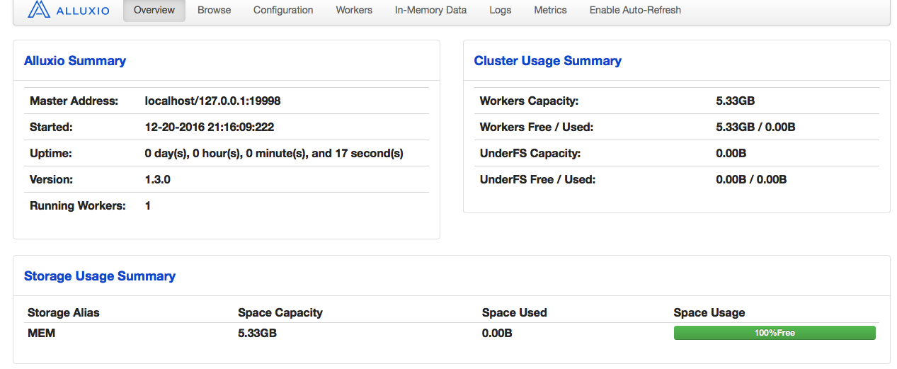
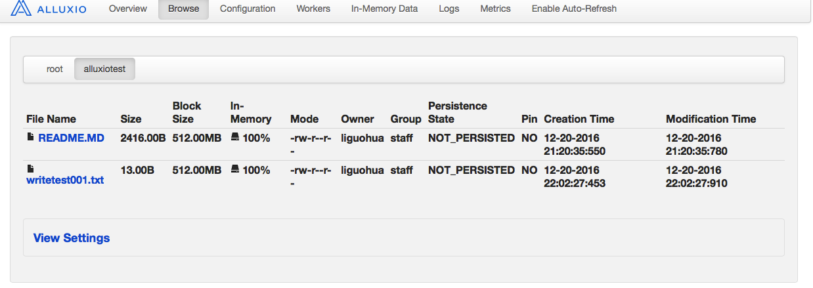
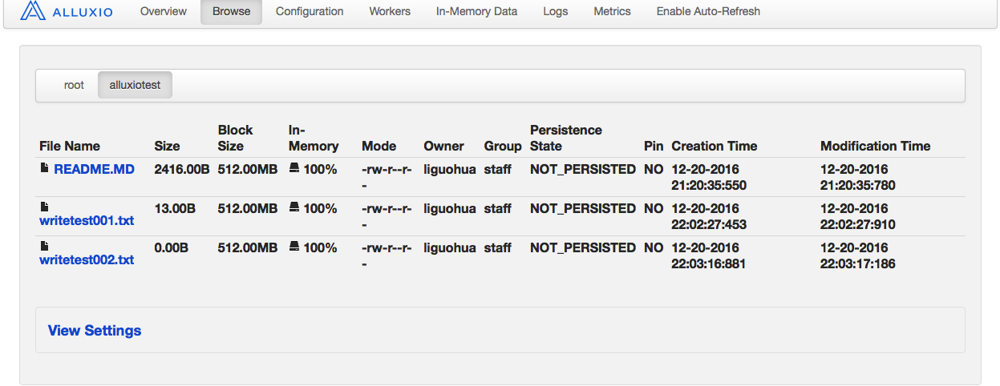

#一、alluxio编程API概述
```
alluxio为我们提供了两种编程API。
1.为了更好的性能，它提供了原始的JavaAPI.
2.为了兼容Hadoop代码它提供了HadoopAPI。
```
#二、alluxio本地运行及数据准备
```
由于JavaAPI在开发时在本地，它默认会连接本地alluxio,所以在开发时，建议启动本地alluxio.
```
##1.启动本地alluxio
```
1.生成本地配置文件
./bin/alluxio bootstrapConf localhost local

2.格式化alluxio文件系统
./bin/alluxio format

3.启动本地alluxio
./bin/alluxio-start.sh local
```
 
##2.准备测试数据
```
1.创建测试文件夹
./bin/alluxio fs mkdir /alluxiotest

2.上传测试文件
./bin/alluxio fs copyFromLocal /Applications/alluxio-1.3.0/README.MD /alluxiotest/
```
 

#三、alluxio原始JavaAPI读取实战
##1.第一种读取方法
###执行程序
```java
package fileSystem.javaapi;
import alluxio.AlluxioURI;
import alluxio.client.file.FileInStream;
import alluxio.client.file.FileSystem;
import alluxio.exception.AlluxioException;

import java.io.IOException;
public class AlluxioReadFile001 {
    public static void main(String[] args) {

        //1.获取文件系统FileSystem
        FileSystem fs = FileSystem.Factory.get();
        //2.创建文件路径 AlluxioURI
        AlluxioURI path = new AlluxioURI("/alluxiotest/README.MD");
        FileInStream in = null;
        try {
            //3.打开文件输入流
            in = fs.openFile(path);

            //4.读取文件内容
            byte[] buffer = new byte[1024];
            for (int len = 0; (len = in.read(buffer)) != -1; ) {
                String content = new String(buffer, 0, len);
                System.out.println(content);
            }
        } catch (IOException e) {
            e.printStackTrace();
        } catch (AlluxioException e) {
            e.printStackTrace();
        } finally {
            try {
                //5.关闭输入流，释放资源
                in.close();
            } catch (IOException e) {
                e.printStackTrace();
            }
        }
    }
}
```
###执行效果
```
能成功读取文件中的内容！
```

##2.第二种读取方法
###执行程序
```java
package fileSystem.javaapi;

import alluxio.AlluxioURI;
import alluxio.client.file.FileInStream;
import alluxio.client.file.FileSystem;
import alluxio.exception.AlluxioException;

import java.io.BufferedInputStream;
import java.io.IOException;

public class AlluxioReadFile002 {
    public static void main(String[] args) {

        //1.获取文件系统FileSystem
        FileSystem fs = FileSystem.Factory.get();
        //2.创建文件路径 AlluxioURI
        AlluxioURI path = new AlluxioURI("/alluxiotest/README.MD");
        FileInStream in = null;
        try {
            //3.打开文件输入流，使用BufferedInputStream读取
            in = fs.openFile(path);
            BufferedInputStream bf = new BufferedInputStream(in);
            //4.读取文件内容
            byte[] buffer = new byte[1024];
            for (int len = 0; (len = bf.read(buffer)) != -1; ) {
                String content = new String(buffer, 0, len);
                System.out.println(content);
            }
        } catch (IOException e) {
            e.printStackTrace();
        } catch (AlluxioException e) {
            e.printStackTrace();
        } finally {
            try {
                //5.关闭输入流，释放资源
                in.close();
            } catch (IOException e) {
                e.printStackTrace();
            }
        }
    }
}
```
###执行效果
```
能成功读取文件中的内容！
```

#四、alluxio原始JavaAPI写出实战
##1.第一种读取方法
###执行程序
```
package fileSystem.javaapi;

import alluxio.AlluxioURI;
import alluxio.client.file.FileOutStream;
import alluxio.client.file.FileSystem;
import alluxio.exception.AlluxioException;

import java.io.IOException;

public class AlluxioWriteFile001 {
    public static void main(String[] args) {
        //1.获取文件系统FileSystem
        FileSystem fs = FileSystem.Factory.get();
        //2.创建文件路径 AlluxioURI
        AlluxioURI path = new AlluxioURI("/alluxiotest/writetest001.txt");
        FileOutStream out = null;
        try {
            //3.打开文件输出流
            out = fs.createFile(path);
            //4.输出文件内容
            out.write("this is test ".getBytes());
        } catch (IOException e) {
            e.printStackTrace();
        } catch (AlluxioException e) {
            e.printStackTrace();
        } finally {
            try {
                //5.关闭输入流，释放资源
                out.close();
            } catch (IOException e) {
                e.printStackTrace();
            }
        }
    }
}
```
###执行效果
 
##1.第二种读取方法
###执行程序
```
package fileSystem.javaapi;

import alluxio.AlluxioURI;
import alluxio.client.file.FileOutStream;
import alluxio.client.file.FileSystem;
import alluxio.exception.AlluxioException;

import java.io.BufferedOutputStream;
import java.io.IOException;

public class AlluxioWriteFile002 {
    public static void main(String[] args) {
        //1.获取文件系统FileSystem
        FileSystem fs = FileSystem.Factory.get();
        //2.创建文件路径 AlluxioURI
        AlluxioURI path = new AlluxioURI("/alluxiotest/writetest001.txt");
        FileOutStream out = null;
        try {
            //3.打开文件输出流,使用BufferedOutputStream输出
            out = fs.createFile(path);
            BufferedOutputStream bo = new BufferedOutputStream(out);
            //4.输出文件内容
            bo.write("this is test ".getBytes());
        } catch (IOException e) {
            e.printStackTrace();
        } catch (AlluxioException e) {
            e.printStackTrace();
        } finally {
            try {
                //5.关闭输入流，释放资源
                out.close();
            } catch (IOException e) {
                e.printStackTrace();
            }
        }
    }
}
```
###执行效果
 