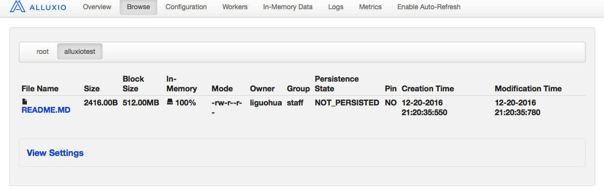

#一、alluxio编程API概述
```
alluxio为我们提供了两种编程API。
1.为了更好的性能，它提供了原生的JavaAPI.
2.为了兼容Hadoop代码它提供了HadoopAPI。
```
#二、alluxio本地运行及数据准备
```
由于JavaAPI在开发时在本地，它默认会连接本地alluxio,所以在开发时，建议启动本地alluxio.
```
##1.启动本地alluxio
```
1.生成本地配置文件
./bin/alluxio bootstrapConf localhost local

2.格式化alluxio文件系统
./bin/alluxio format

3.启动本地alluxio
./bin/alluxio-start.sh local
```
 
##2.准备测试数据
```
1.创建测试文件夹
./bin/alluxio fs mkdir /alluxiotest

2.上传测试文件
./bin/alluxio fs copyFromLocal /Applications/alluxio-1.3.0/README.MD /alluxiotest/
```
 

#三、alluxio原生JavaAPI读取实战
###执行程序
```java
package fileSystem.javaapi;
import alluxio.AlluxioURI;
import alluxio.client.file.FileInStream;
import alluxio.client.file.FileSystem;
import alluxio.exception.AlluxioException;

import java.io.IOException;
public class AlluxioReadFile001 {
    public static void main(String[] args) {

        //1.获取文件系统FileSystem
        FileSystem fs = FileSystem.Factory.get();
        //2.创建文件路径 AlluxioURI
        AlluxioURI path = new AlluxioURI("/alluxiotest/README.MD");
        FileInStream in = null;
        try {
            //3.打开文件输入流
            in = fs.openFile(path);

            //4.读取文件内容
            byte[] buffer = new byte[1024];
            for (int len = 0; (len = in.read(buffer)) != -1; ) {
                String content = new String(buffer, 0, len);
                System.out.println(content);
            }
        } catch (IOException e) {
            e.printStackTrace();
        } catch (AlluxioException e) {
            e.printStackTrace();
        } finally {
            try {
                //5.关闭输入流，释放资源
                in.close();
            } catch (IOException e) {
                e.printStackTrace();
            }
        }
    }
}
```
###执行效果
```
能成功读取文件中的内容！
```


#四、alluxio原生JavaAPI写出实战
###执行程序
```
package fileSystem.javaapi;

import alluxio.AlluxioURI;
import alluxio.client.file.FileOutStream;
import alluxio.client.file.FileSystem;
import alluxio.exception.AlluxioException;

import java.io.IOException;

public class AlluxioWriteFile001 {
    public static void main(String[] args) {
        //1.获取文件系统FileSystem
        FileSystem fs = FileSystem.Factory.get();
        //2.创建文件路径 AlluxioURI
        AlluxioURI path = new AlluxioURI("/alluxiotest/writetest001.txt");
        FileOutStream out = null;
        try {
            //3.打开文件输出流
            out = fs.createFile(path);
            //4.输出文件内容
            out.write("this is test ".getBytes());
        } catch (IOException e) {
            e.printStackTrace();
        } catch (AlluxioException e) {
            e.printStackTrace();
        } finally {
            try {
                //5.关闭输入流，释放资源
                out.close();
            } catch (IOException e) {
                e.printStackTrace();
            }
        }
    }
}
```
###执行效果
 
#五、alluxio的存储系统和IO选项
##1.alluxio的存储系统
```
alluxio视野中有两种存储
1.alluxio自己管理的存储，包括内存，SSD,HDD.
2.alluxio的底层文件系统，包括HDFS,S3,Swift,ceph等
```
##2.alluxio的IO选项
```
因为有自己管理的存储和底层存储两种系统，因此在操作自己管理的存储系统的时候如何操作底层存储就成了问题。
1.在读取自己管理的存储系统时候怎样操作底层存储系统。ReadType
2.在写入自己管理的存储系统时候怎样操作底层存储系统。WriteType
```

##3.alluxio的ReadType
|读类型|行为|
|---|---|
|CACHE_PROMOTE|如果读取的数据在Worker上时，该数据被移动到Worker的最高层。如果该数据不在本地Worker的Alluxio存储中，那么就将一个副本添加到本地Alluxio Worker中，用于每次完整地读取数据块。这是默认的读类型。|
|CACHE|如果该数据不在本地Worker的Alluxio存储中，那么就将一个副本添加到本地Alluxio Worker中，用于每次完整地读取数据块。|
|NO_CACHE|不会创建副本|

##4.alluxio的WriteType
|写类型|行为|
|---|---|
|CACHE_THROUGH|数据被同步地写入到Alluxio的Worker和底层存储系统。|
|MUST_CACHE|数据被同步地写入到Alluxio的Worker。但不会被写入到底层存储系统。这是默认写类型。|
|THROUGH|数据被同步地写入到底层存储系统。但不会被写入到Alluxio的Worker。|
|ASYNC_THROUGH|	数据被同步地写入到Alluxio的Worker，并异步地写入到底层存储系统。处于实验阶段。|

#六、alluxio的定位策略
##1.alluxio的定位策略问题产生
```
因为alluxio是一个分布式的系统，因此在读写文件时的另一问题是，如何定位分散在多个worker上的数据。
1.配置文件中的定位策略
用户可以简单的覆盖默认策略类通过修改配置文件alluxio.user.file.write.location.policy.class内的属性

2.api中的定位策略
使用Alluxio的Java API，用户可以在CreateFileOptions中设置该策略以用于写文件，也可在OpenFileOptions
中设置该策略用于向Alluxio中读文件。
```
##2.alluxio内置的定位策略
|策略|意义|
|---|---|
|LocalFirstPolicy(alluxio.client.file.policy.LocalFirstPolicy)|首先返回本地主机，如果本地Worker没有足够的容量容纳一个数据块，那么就会从有效的Worker列表中随机选择一个Worker。这也是默认策略。|
|MostAvailableFirstPolicy (alluxio.client.file.policy.MostAvailableFirstPolicy)|返回拥有最多可用容量的Worker|
|RoundRobinPolicy (alluxio.client.file.policy.RoundRobinPolicy)|以循环的方式选取存储下一个数据块的Worker，如果该Worker没有足够的容量，就将其跳过。|
|SpecificHostPolicy (alluxio.client.file.policy.SpecificHostPolicy)|返回指定主机名的Worker。该策略不能被设置为默认策略。|
##3.alluxio自定义的定位策略
```
Alluxio支持自定义策略，所以你可以通过实现接口alluxio.client.file.policyFileWriteLocationPolicy，开发自己的
定位策略来迎合应用需求。注意默认策略必须要有一个空构造函数。要想使用ASYNC_THROUGH写类型，所有的文件数据块必须被写到
相同的Worker上。
```


#七、封装alluxio原生JavaAPI工具类
###封装原理
```
根据alluxio为我们提供的原生JavaAPI编程接口，我们可以自行封装一个比较好用的工具类，以便我们开发使用。
```
###执行程序
```java
package fileSystem.javaapi;

import alluxio.AlluxioURI;
import alluxio.client.ReadType;
import alluxio.client.WriteType;
import alluxio.client.file.FileSystem;
import alluxio.client.file.URIStatus;
import alluxio.client.file.options.CreateFileOptions;
import alluxio.client.file.options.OpenFileOptions;
import alluxio.exception.AlluxioException;

import java.io.*;
import java.util.ArrayList;
import java.util.List;

public class AlluxioFsUitls {
    //获取文件系统FileSystem
    private static final FileSystem fs = FileSystem.Factory.get();

    /**
     * 此方法用于添加挂载点
     *
     * @param alluxioFilePath 文件路径
     */
    public static void mount(String alluxioFilePath, String underFileSystemPath) {
        //1.创建文件路径 AlluxioURI
        AlluxioURI apath = new AlluxioURI(alluxioFilePath);
        AlluxioURI upath = new AlluxioURI(alluxioFilePath);
        try {
            //2.添加挂载点
            if (!fs.exists(apath)) {
                fs.mount(apath, upath);
            }
        } catch (IOException e) {
            e.printStackTrace();
        } catch (AlluxioException e) {
            e.printStackTrace();
        }
    }

    /**
     * 此方法用于删除挂载点
     *
     * @param filePath 文件路径
     */
    public static void unmount(String filePath) {
        //1.创建文件路径 AlluxioURI
        AlluxioURI path = new AlluxioURI(filePath);
        try {
            //2.删除挂载点
            if (fs.exists(path)) {
                fs.unmount(path);
            }
        } catch (IOException e) {
            e.printStackTrace();
        } catch (AlluxioException e) {
            e.printStackTrace();
        }
    }

    /**
     * 此方法用于创建文件，并向文件中输出内容WriteType.ASYNC_THROUGH
     * 数据被同步地写入到Alluxio的Worker，并异步地写入到底层存储系统。处于实验阶段。
     *
     * @param filePath 文件路径
     * @param contents 向文件中输出的内容
     * @return 文件创建，是否成功
     */
    public static boolean createFileMustAsysncThroughWriteTpye(String filePath,
    List<String> contents) {
        return createFile(filePath, contents,
                CreateFileOptions.defaults().setWriteType(WriteType.ASYNC_THROUGH));
    }

    /**
     * 此方法用于创建文件，并向文件中输出内容WriteType.CACHE_THROUGH
     * 数据被同步地写入到Alluxio的Worker和底层存储系统。
     *
     * @param filePath 文件路径
     * @param contents 向文件中输出的内容
     * @return 文件创建，是否成功
     */
    public static boolean createFileMustCacheThroughWriteTpye(String filePath,
    List<String> contents) {
        return createFile(filePath, contents,
                CreateFileOptions.defaults().setWriteType(WriteType.CACHE_THROUGH));
    }

    /**
     * 此方法用于创建文件，并向文件中输出内容WriteType.THROUGH
     * 数据被同步地写入到底层存储系统。但不会被写入到Alluxio的Worker。
     *
     * @param filePath 文件路径
     * @param contents 向文件中输出的内容
     * @return 文件创建，是否成功
     */
    public static boolean createFileMustThroughWriteTpye(String filePath, List<String> contents) {
        return createFile(filePath, contents,
                CreateFileOptions.defaults().setWriteType(WriteType.THROUGH));
    }

    /**
     * 此方法用于创建文件，并向文件中输出内容WriteType.MUST_CACHE
     * 数据被同步地写入到Alluxio的Worker。但不会被写入到底层存储系统。这是默认写类型。
     *
     * @param filePath 文件路径
     * @param contents 向文件中输出的内容
     * @return 文件创建，是否成功
     */
    public static boolean createFileMustCacheWriteTpye(String filePath, List<String> contents) {
        return createFile(filePath, contents,
                CreateFileOptions.defaults().setWriteType(WriteType.MUST_CACHE));
    }

    /**
     * 方法用于创建文件，并向文件中输出内容
     *
     * @param filePath 文件路径
     * @param contents 向文件中输出的内容
     * @param options  CreateFileOptions
     * @return 文件创建，是否成功
     */
    public static boolean createFile(String filePath, List<String> contents,
    CreateFileOptions options) {
        //1.创建文件路径 AlluxioURI
        AlluxioURI path = new AlluxioURI(filePath);
        BufferedWriter writer = null;
        try {
            //2.打开文件输出流,使用BufferedWriter输出
            if (!fs.exists(path)) {
                writer = new BufferedWriter(new OutputStreamWriter(fs.createFile(path, options)));
                //3.输出文件内容
                for (String line : contents) {
                    writer.write(line);
                    writer.newLine();
                }
            }
            //3.如果文件存在，则表示执行成功
            return fs.exists(path);

        } catch (IOException e) {
            e.printStackTrace();
        } catch (AlluxioException e) {
            e.printStackTrace();
        } finally {
            try {
                //4.关闭输入流，释放资源
                if (writer != null) {
                    writer.close();
                }
            } catch (IOException e) {
                e.printStackTrace();
            }
        }
        return false;
    }

    /**
     * 此方法用于读取alluxio文件ReadType.CACHE_PROMOTE
     * 如果读取的数据在Worker上时，该数据被移动到Worker的最高层。如果该数据不在本地Worker的Alluxio存储中，
     * 那么就将一个副本添加到本地Alluxio Worker中，用于每次完整地读取数据块。这是默认的读类型。
     *
     * @param filePath 文件路径
     * @return 文件的内容
     */
    public static List<String> openFilePromoteCacheReadType(String filePath) {
        return openFile(filePath, OpenFileOptions.defaults().setReadType(ReadType.CACHE_PROMOTE));
    }

    /**
     * 此方法用于读取alluxio文件ReadType.NO_CACHE
     * 不会创建副本
     *
     * @param filePath 文件路径
     * @return 文件的内容
     */
    public static List<String> openFileNoCacheReadType(String filePath) {
        return openFile(filePath, OpenFileOptions.defaults().setReadType(ReadType.NO_CACHE));
    }

    /**
     * 此方法用于读取alluxio文件ReadType.CACHE
     * 如果该数据不在本地Worker的Alluxio存储中，那么就将一个副本添加到本地Alluxio Worker中，
     * 用于每次完整地读取数据块。
     *
     * @param filePath 文件路径
     * @return 文件的内容
     */
    public static List<String> openFileCacheReadType(String filePath) {
        return openFile(filePath, OpenFileOptions.defaults().setReadType(ReadType.CACHE));
    }

    /**
     * 此方法用于读取alluxio文件DefalutReadType
     *
     * @param filePath 文件路径
     * @return 文件的内容
     */
    public static List<String> openFileDefalutReadType(String filePath) {
        return openFile(filePath, OpenFileOptions.defaults());
    }


    /**
     * 此方法用于读取alluxio文件
     *
     * @param filePath 文件路径
     * @param options  文件读取选项
     * @return 文件的内容
     */
    public static List<String> openFile(String filePath, OpenFileOptions options) {
        List<String> list = new ArrayList<>();
        //1.创建文件路径 AlluxioURI
        AlluxioURI path = new AlluxioURI(filePath);
        BufferedReader reader = null;
        try {
            //2.打开文件输入流，使用 BufferedReader按行读取
            if (fs.exists(path)) {
                reader = new BufferedReader(new InputStreamReader(fs.openFile(path, options)));
                for (String line = null; (line = reader.readLine()) != null; ) {
                    list.add(line);
                }
                return list;
            }
        } catch (IOException e) {
            e.printStackTrace();
        } catch (AlluxioException e) {
            e.printStackTrace();
        } finally {
            try {
                //3.关闭输入流，释放资源
                if (reader != null) {
                    reader.close();
                }
            } catch (IOException e) {
                e.printStackTrace();
            }
        }
        return list;
    }

    /**
     * 此方法用于释放alluxio中的文件或路径
     *
     * @param filePath 文件路径
     * @return 释放文件, 是否成功
     */
    public static boolean free(String filePath) {
        //1.创建文件路径 AlluxioURI
        AlluxioURI path = new AlluxioURI(filePath);
        try {
            //2.释放文件
            if (fs.exists(path)) {
                fs.free(path);
            }
            //3.判定文件是否不存在，如果不存在则删除成功！
            return !fs.exists(path);
        } catch (IOException e) {
            e.printStackTrace();
        } catch (AlluxioException e) {
            e.printStackTrace();
        }
        return false;
    }


    /**
     * 此方法用于删除文件或路径
     *
     * @param filePath 文件路径
     * @return 删除文件, 是否成功
     */
    public static boolean delete(String filePath) {
        //1.创建文件路径 AlluxioURI
        AlluxioURI path = new AlluxioURI(filePath);
        try {
            //2.删除文件
            if (fs.exists(path)) {
                fs.delete(path);
            }
            //3.判定文件是否不存在，如果不存在则删除成功！
            return !fs.exists(path);
        } catch (IOException e) {
            e.printStackTrace();
        } catch (AlluxioException e) {
            e.printStackTrace();
        }
        return false;
    }


    /**
     * 此方法用于创建文件夹
     *
     * @param dirPath 文件夹路径
     * @return 创建文件夹, 是否成功
     */
    public static boolean createDirectory(String dirPath) {
        //1.创建文件路径 AlluxioURI
        AlluxioURI path = new AlluxioURI(dirPath);
        try {
            //2.创建文件夹
            if (!fs.exists(path)) {
                fs.createDirectory(path);
            }
            //3.再次判定文件夹是否存在，来确定文件夹是否创建成功
            return fs.exists(path);
        } catch (IOException e) {
            e.printStackTrace();
        } catch (AlluxioException e) {
            e.printStackTrace();
        }
        return false;
    }

    /**
     * 此方法用于获取文件状态信息
     *
     * @param filePath 文件路径
     * @return List<URIStatus>
     */
    public static List<URIStatus> listStatus(String filePath) {
        //1.创建文件路径 AlluxioURI
        AlluxioURI path = new AlluxioURI(filePath);
        try {
            //2.获取文件状态信息
            if (fs.exists(path)) {
                return fs.listStatus(path);
            }
        } catch (IOException e) {
            e.printStackTrace();
        } catch (AlluxioException e) {
            e.printStackTrace();
        }
        return null;
    }

    /**
     * 此方法用于获取文件状态信息
     *
     * @param filePath 文件路径
     * @return URIStatus
     */
    public static URIStatus getStatus(String filePath) {
        //1.创建文件路径 AlluxioURI
        AlluxioURI path = new AlluxioURI(filePath);
        try {
            //2.获取文件状态信息
            if (fs.exists(path)) {
                return fs.getStatus(path);
            }
        } catch (IOException e) {
            e.printStackTrace();
        } catch (AlluxioException e) {
            e.printStackTrace();
        }
        return null;
    }

    /**
     * 此方法用于判定文件是否存在
     *
     * @param filePath 文件路径
     * @return 文件是否存在
     */
    public static boolean exists(String filePath) {
        //1.创建文件路径 AlluxioURI
        AlluxioURI path = new AlluxioURI(filePath);
        try {
            //2.获取文件状态信息
            return fs.exists(path);
        } catch (IOException e) {
            e.printStackTrace();
        } catch (AlluxioException e) {
            e.printStackTrace();
        }
        return false;
    }

    /**
     * 此方法用于重命名文件
     *
     * @param sourcePath 原文件路径
     * @param distPath   目的文件路径
     * @return 重命名是否成功
     */
    public static boolean rename(String sourcePath, String distPath) {
        //1.创建文件路径 AlluxioURI
        AlluxioURI sourcepath = new AlluxioURI(sourcePath);
        AlluxioURI distpath = new AlluxioURI(distPath);
        try {
            //2.重命名操作
            if (fs.exists(sourcepath)) {
                fs.rename(sourcepath, distpath);
            }
            //3.判定源文件和目标文件是否存在，来判定重命名是否成功
             return ((fs.exists(distpath))&&(!fs.exists(sourcepath)));
        } catch (IOException e) {
            e.printStackTrace();
        } catch (AlluxioException e) {
            e.printStackTrace();
        }
        return false;
    }
}
```
#八、封装alluxio兼容HadoopAPI工具类
###1.alluxio兼容HadoopAPI工具类
```java
package fileSystem.javaapi;


import org.apache.hadoop.conf.Configuration;
import org.apache.hadoop.fs.*;
import org.apache.hadoop.io.IOUtils;

import java.io.File;
import java.io.IOException;
import java.io.OutputStream;
import java.net.URI;
import java.util.ArrayList;
import java.util.List;

/**
 * Created by liguohua on 22/12/2016.
 */
public class HdfsAndAlluxioUtils {

    private static final String NOT_EXEXTS_EXECEPTION_MSG = "Path is not exist:";
    private static final String NOT_DIR_EXECEPTION_MSG = "Path is not a directory:";
    private static final String NOT_FILE_EXECEPTION_MSG = "path is not a file:";
    private static String PATH_DELIMER = "/";

    /**
     * 此方法用于move文件或文件夹到分布式系统
     *
     * @param fileSystemInfo 文件系统信息
     * @param src            分布式系统路径
     * @param dist           本地路径
     */
    public static void moveToLocalFile(FileSystemInfo fileSystemInfo, String src, String dist) {
        copyOrMoveToLocalFile(fileSystemInfo, src, dist, true, true);
    }

    /**
     * 此方法用于copy文件或文件夹到分布式系统
     *
     * @param fileSystemInfo 文件系统信息
     * @param src            分布式系统路径
     * @param dist           本地路径
     */
    public static void copyToLocalFile(FileSystemInfo fileSystemInfo, String src, String dist) {
        copyOrMoveToLocalFile(fileSystemInfo, src, dist, true, false);
    }

    /**
     * 此方法用于copy或remove文件或文件夹到分布式系统
     *
     * @param fileSystemInfo 文件系统信息
     * @param src            分布式系统路径
     * @param dist           本地路径
     * @param deleteCrc      是否删除本地生成的crc检验文件
     * @param deleteSrcDir   是否删除分布式系统上的文件
     */
    public static void copyOrMoveToLocalFile(FileSystemInfo fileSystemInfo, String src, String dist, boolean deleteCrc, boolean deleteSrcDir) {
        FileSystem fs = getFileSystem(fileSystemInfo);
        Path hdfsPath = new Path(src);
        try {
            //文件不存在的异常返回
            pathNotExistCheck(src, fs, hdfsPath);
            //文件存在的情况下进行download操作
            FileStatus fileStatus = fs.getFileStatus(hdfsPath);
            if (fileStatus.isDirectory()) {
                //如果是dir
                dist = convertToPath(dist) + fileStatus.getPath().getName();
                File localFileDir = new File(dist);
                if (!localFileDir.exists()) {
                    localFileDir.mkdirs();
                }
                //遍历hdfs的dir中的所有文件
                FileStatus contents[] = fs.listStatus(hdfsPath);
                for (int i = 0; i < contents.length; i++) {
                    copyOrMoveToLocalFile(fileSystemInfo, contents[i].getPath().toString(), dist, deleteCrc, deleteSrcDir);
                }
            } else {
                //如果是file
                Path localPathOrFilePath = new Path(dist);
                fs.copyToLocalFile(hdfsPath, localPathOrFilePath);
                //删除local生成的crc校验文件
                if (deleteCrc) {
                    String crcFileName = "." + hdfsPath.getName() + ".crc";
                    String crcFileAbsolutePath = convertToPath(dist) + crcFileName;
                    File crcFile = new File(crcFileAbsolutePath);
                    crcFile.deleteOnExit();
                }
            }
            if (deleteSrcDir) {
                fs.delete(hdfsPath, true);
            }

        } catch (IOException e) {
            e.printStackTrace();
        } finally {
            closeFileSystem(fs);
        }

    }

    /**
     * 此方法用于move本地文件或文件夹到分布式系统
     * <p>
     * alluxio是否能穿透到hdfs要根据它的配置情况而定
     *
     * @param fileSystemInfo 文件系统信息
     * @param src            本地路径
     * @param dist           分布式系统路径
     */
    public static void moveFromLocalFile(FileSystemInfo fileSystemInfo, String src, String dist) {
        copyOrMoveFromLocalFile(fileSystemInfo, src, dist, true, true);
    }

    /**
     * 此方法用于copy本地文件或文件夹到分布式系统
     * <p>
     * alluxio是否能穿透到hdfs要根据它的配置情况而定
     *
     * @param fileSystemInfo 文件系统信息
     * @param src            本地路径
     * @param dist           分布式系统路径
     */
    public static void copyFromLocalFile(FileSystemInfo fileSystemInfo, String src, String dist) {
        copyOrMoveFromLocalFile(fileSystemInfo, src, dist, true, false);
    }

    /**
     * 此方法用于copy或move本地文件或文件夹到分布式系统
     * <p>
     * alluxio是否能穿透到hdfs要根据它的配置情况而定
     *
     * @param fileSystemInfo 文件系统信息
     * @param src            本地路径
     * @param dist           分布式系统路径
     * @param delSrc         是否删除本地文件
     */
    public static void copyOrMoveFromLocalFile(FileSystemInfo fileSystemInfo, String src, String dist, boolean overwrite, boolean delSrc) {
        FileSystem fs = getFileSystem(fileSystemInfo);
        //local
        Path localDirOrFilePath = new Path(src);
        //hdfs
        Path remoteDirPath = new Path(dist);
        try {
            File localFile = new File(src);
            //如果本地文件不存在，直接返回
            if (!localFile.exists()) {
                return;
            }
            if (isPath(dist)) {
                if (!fs.exists(remoteDirPath)) {
                    fs.mkdirs(remoteDirPath);
                }
            }
            if (localFile.isDirectory()) {
                //dir
                dist = convertToPath(dist) + localFile.getName();
                remoteDirPath = new Path(dist);
                if (!fs.exists(remoteDirPath)) {
                    fs.mkdirs(remoteDirPath);
                }
                //遍历本地dir中的所有文件
                File[] listFiles = localFile.listFiles();
                for (File f : listFiles) {
                    copyOrMoveFromLocalFile(fileSystemInfo, f.getAbsolutePath(), convertToPath(dist), overwrite, delSrc);
                }
            } else {
                //file
                fs.copyFromLocalFile(delSrc, overwrite, localDirOrFilePath, remoteDirPath);
            }
        } catch (IOException e) {
            e.printStackTrace();
        } finally {
            closeFileSystem(fs);
        }
    }

    /**
     * 此方法用于创建新文件，并向文件写入内容
     * <p>
     * alluxio是否能穿透到hdfs要根据它的配置情况而定
     *
     * @param fileSystemInfo 文件系统信息
     * @param path           文件路径
     * @param overWrite      文件存在是否覆盖
     * @param fileContent    写入文件的内容
     */
    public static void create(FileSystemInfo fileSystemInfo, String path, boolean overWrite, String fileContent) {
        FileSystem fs = getFileSystem(fileSystemInfo);
        Path uri = new Path(path);
        FSDataOutputStream output = null;
        try {
            byte[] bytes = fileContent.getBytes();
            //创建文件
            output = fs.create(uri, overWrite);
            //写入文件
            output.write(bytes);
            //刷出缓存
            output.flush();
        } catch (IOException e) {
            e.printStackTrace();
        } finally {
            try {
                if (output != null) {
                    output.close();
                }
            } catch (IOException e) {
                e.printStackTrace();
            }

            closeFileSystem(fs);
        }
    }

    /**
     * 此方法用于创建新文件
     * <p>
     * alluxio是否能穿透到hdfs要根据它的配置情况而定
     *
     * @param fileSystemInfo 文件系统信息
     * @param path           文件路径
     * @return 创建新文件是否成功
     */
    public static boolean createNewFile(FileSystemInfo fileSystemInfo, String path) {
        FileSystem fs = getFileSystem(fileSystemInfo);
        Path uri = new Path(path);
        try {
            if (!fs.exists(uri)) {
                return fs.createNewFile(uri);
            }
        } catch (IOException e) {
            e.printStackTrace();
        } finally {
            closeFileSystem(fs);
        }
        return false;
    }

    /**
     * 此方法用于判断文件是否是file
     *
     * @param fileSystemInfo 文件系统信息
     * @param path           文件路径
     * @return 是否是file
     */
    public static boolean isFile(FileSystemInfo fileSystemInfo, String path) {
        FileSystem fs = getFileSystem(fileSystemInfo);
        Path uri = new Path(path);
        try {
            pathNotExistCheck(path, fs, uri);
            return fs.isFile(uri);
        } catch (IOException e) {
            e.printStackTrace();
        } finally {
            closeFileSystem(fs);
        }
        return false;
    }

    /**
     * 此方法用于判断文件是否是dir
     *
     * @param fileSystemInfo 文件系统信息
     * @param path           文件路径
     * @return 是否是dir
     */
    public static boolean isDirectory(FileSystemInfo fileSystemInfo, String path) {
        FileSystem fs = getFileSystem(fileSystemInfo);
        Path uri = new Path(path);
        try {
            pathNotExistCheck(path, fs, uri);
            return fs.isDirectory(uri);
        } catch (IOException e) {
            e.printStackTrace();
        } finally {
            closeFileSystem(fs);
        }
        return false;
    }

    /**
     * 此方法用于删除文件
     *
     * @param fileSystemInfo 文件系统信息
     * @param path           文件路径
     * @return 删除文件是否成功
     */
    public static boolean delete(FileSystemInfo fileSystemInfo, String path) {
        FileSystem fs = getFileSystem(fileSystemInfo);
        Path uri = new Path(path);
        try {
            if (fs.exists(uri)) {
                return fs.delete(uri, true);
            }
        } catch (IOException e) {
            e.printStackTrace();
        } finally {
            closeFileSystem(fs);
        }
        return false;
    }

    /**
     * 此方法用于查看文件中损坏的块
     *
     * @param fileSystemInfo 文件系统信息
     * @param path           文件路径
     * @return 查看文件中损坏的块
     */
    public static RemoteIterator<Path> listCorruptFileBlocks(FileSystemInfo fileSystemInfo, String path) {
        FileSystem fs = getFileSystem(fileSystemInfo);
        Path uri = new Path(path);
        try {
            pathNotExistCheck(path, fs, uri);
            return fs.listCorruptFileBlocks(uri);
        } catch (IOException e) {
            e.printStackTrace();
        } finally {
            closeFileSystem(fs);
        }
        return null;
    }

    /**
     * 此方法用于查看文件中损坏的块
     *
     * @param fileSystemInfo 文件系统信息
     * @param target         目标文件路径
     * @param link           link文件路径
     * @param createParent   是否创建父目录
     */
    public static void createSymlink(FileSystemInfo fileSystemInfo, String target, String link, boolean createParent) {
        FileSystem fs = getFileSystem(fileSystemInfo);
        Path urit = new Path(target);
        Path uril = new Path(link);
        try {
            pathNotExistCheck(target, fs, urit);
            fs.createSymlink(urit, uril, createParent);
        } catch (IOException e) {
            e.printStackTrace();
        } finally {
            closeFileSystem(fs);
        }
    }

    /**
     * 此方法用于判断是否支持Symlink
     *
     * @param fileSystemInfo 文件系统信息
     * @return 是否支持Symlink
     */
    public static boolean supportsSymlinks(FileSystemInfo fileSystemInfo) {
        FileSystem fs = getFileSystem(fileSystemInfo);
        try {
            return fs.supportsSymlinks();
        } finally {
            closeFileSystem(fs);
        }
    }

    /**
     * 此方法用于创建文件夹
     *
     * @param fileSystemInfo 文件系统信息
     * @param path           文件路径
     * @return 创建文件夹是否成功
     */
    public static boolean mkdirs(FileSystemInfo fileSystemInfo, String path) {
        FileSystem fs = getFileSystem(fileSystemInfo);
        Path uri = new Path(path);
        try {
            if (!fs.exists(uri)) {
                return fs.mkdirs(uri);
            }
        } catch (IOException e) {
            e.printStackTrace();
        } finally {
            closeFileSystem(fs);
        }
        return false;
    }

    /**
     * 此方法用于创建文件快照
     * 需要开启快照支持hdfs dfsadmin -allowSnapshot /path/to/snapshot
     *
     * @param fileSystemInfo 文件系统信息
     * @param path           文件路径
     * @param snapshotName   快照名称
     * @return 快照路径
     */
    public static Path createSnapshot(FileSystemInfo fileSystemInfo, String path, String snapshotName) {
        FileSystem fs = getFileSystem(fileSystemInfo);
        Path uri = new Path(path);
        try {
            pathNotExistCheck(path, fs, uri);
            pathNotDirectoryCheck(path, fs, uri);
            return fs.createSnapshot(uri, snapshotName);
        } catch (IOException e) {
            e.printStackTrace();
        } finally {
            closeFileSystem(fs);
        }
        return null;
    }


    /**
     * 此方法用于重命名文件快照
     *
     * @param fileSystemInfo  文件系统信息
     * @param path            文件路径
     * @param snapshotOldName 旧快照名称
     * @param snapshotNewName 新快照名称
     */
    public static void renameSnapshot(FileSystemInfo fileSystemInfo, String path, String snapshotOldName, String snapshotNewName) {
        FileSystem fs = getFileSystem(fileSystemInfo);
        Path uri = new Path(path);
        try {
            pathNotExistCheck(path, fs, uri);
            pathNotDirectoryCheck(path, fs, uri);
            fs.renameSnapshot(uri, snapshotOldName, snapshotNewName);
        } catch (IOException e) {
            e.printStackTrace();
        } finally {
            closeFileSystem(fs);
        }
    }

    /**
     * 此方法用于删除文件快照
     *
     * @param fileSystemInfo 文件系统信息
     * @param path           文件路径
     * @param snapshotName   快照名称
     */
    public static void deleteSnapshot(FileSystemInfo fileSystemInfo, String path, String snapshotName) {
        FileSystem fs = getFileSystem(fileSystemInfo);
        Path uri = new Path(path);
        try {
            pathNotExistCheck(path, fs, uri);
            pathNotDirectoryCheck(path, fs, uri);
            fs.deleteSnapshot(uri, snapshotName);
        } catch (IOException e) {
            e.printStackTrace();
        } finally {
            closeFileSystem(fs);
        }
    }

    /**
     * 此方法用于设置文件的拥有者
     *
     * @param fileSystemInfo 文件系统信息
     * @param path           文件路径
     * @param user           用户
     * @param group          用户组
     */
    public static void setOwner(FileSystemInfo fileSystemInfo, String path, String user, String group) {
        FileSystem fs = getFileSystem(fileSystemInfo);
        Path uri = new Path(path);
        try {
            pathNotExistCheck(path, fs, uri);
            fs.setOwner(uri, user, group);
        } catch (IOException e) {
            e.printStackTrace();
        } finally {
            closeFileSystem(fs);
        }
    }

    /**
     * 此方法用于重命名文件
     *
     * @param fileSystemInfo 文件系统信息
     * @param patho          原文件路径
     * @param pathn          目标文件路径
     * @return 文件是否重命名成功
     */
    public static boolean rename(FileSystemInfo fileSystemInfo, String patho, String pathn) {
        FileSystem fs = getFileSystem(fileSystemInfo);
        Path urio = new Path(patho);
        Path urin = new Path(pathn);
        try {
            //重命名
            if (fs.exists(urio)) {
                return fs.rename(urio, urin);
            }
        } catch (IOException e) {
            e.printStackTrace();
        } finally {
            closeFileSystem(fs);
        }
        return false;
    }

    /**
     * 此方法用于读取文件内容,到标准输出流
     *
     * @param fileSystemInfo 文件系统信息
     * @param path           文件路径
     */
    public static void open(FileSystemInfo fileSystemInfo, String path) {
        open(fileSystemInfo, path, System.out, 4096, true);
    }

    /**
     * 此方法用于读取文件内容,到输出流
     *
     * @param fileSystemInfo 文件系统信息
     * @param path           文件路径
     * @param outputStream   输出流
     */
    public static void open(FileSystemInfo fileSystemInfo, String path, OutputStream outputStream) {
        open(fileSystemInfo, path, outputStream, 4096, true);
    }

    /**
     * 此方法用于读取文件内容，到输出流
     *
     * @param fileSystemInfo 文件系统信息
     * @param path           文件路径
     * @param outputStream   输出流
     * @param bufferSize     输出缓存大小
     * @param close          文件输出后是否关闭输出流
     */
    public static void open(FileSystemInfo fileSystemInfo, String path, OutputStream outputStream, int bufferSize, boolean close) {
        FileSystem fs = getFileSystem(fileSystemInfo);
        Path uri = new Path(path);
        try {
            //1.检查文件是否合法
            pathNotExistCheck(path, fs, uri);
            pathNotFileCheck(path, fs, uri);
            //2.读取文件内容
            IOUtils.copyBytes(fs.open(uri), outputStream, bufferSize, close);
        } catch (IOException e) {
            e.printStackTrace();
        } finally {
            closeFileSystem(fs);
        }
    }

    /**
     * 此方法用于判断是否存在文件
     *
     * @param fileSystemInfo 文件系统信息
     * @param path           文件路径
     * @return 文件是否存在
     */
    public static boolean exists(FileSystemInfo fileSystemInfo, String path) {
        FileSystem fs = getFileSystem(fileSystemInfo);
        Path uri = new Path(path);
        try {
            return fs.exists(uri);
        } catch (IOException e) {
            e.printStackTrace();
        } finally {
            closeFileSystem(fs);
        }
        return false;
    }

    /**
     * 此方法用于获取文件系统的使用容量
     *
     * @param fileSystemInfo 文件系统信息
     * @return 文件系统的使用容量
     */
    public static long getUsed(FileSystemInfo fileSystemInfo) {
        FileSystem fs = getFileSystem(fileSystemInfo);
        try {
            return fs.getUsed();
        } catch (IOException e) {
            e.printStackTrace();
        } finally {
            closeFileSystem(fs);
        }
        return -1;
    }

    /**
     * 此方法用于获取文件的 Uri
     *
     * @param fileSystemInfo 文件系统信息
     * @return Uri
     */
    public static URI getUri(FileSystemInfo fileSystemInfo) {
        FileSystem fs = getFileSystem(fileSystemInfo);
        try {
            return fs.getUri();
        } finally {
            closeFileSystem(fs);
        }
    }

    /**
     * 此方法用于获取文件的 ContentSummary
     *
     * @param fileSystemInfo 文件系统信息
     * @param path           文件路径
     * @return ContentSummary
     */
    public static ContentSummary getContentSummary(FileSystemInfo fileSystemInfo, String path) {
        FileSystem fs = getFileSystem(fileSystemInfo);
        Path uri = new Path(path);
        try {
            pathNotExistCheck(path, fs, uri);
            return fs.getContentSummary(uri);
        } catch (IOException e) {
            e.printStackTrace();
        } finally {
            closeFileSystem(fs);
        }
        return null;
    }

    /**
     * 此方法用于获取文件的FileChecksum
     *
     * @param fileSystemInfo 文件系统信息
     * @param path           文件路径
     * @return FileChecksum
     */
    public static FileChecksum getFileChecksum(FileSystemInfo fileSystemInfo, String path) {
        FileSystem fs = getFileSystem(fileSystemInfo);
        Path uri = new Path(path);
        try {
            pathNotExistCheck(path, fs, uri);
            return fs.getFileChecksum(uri);
        } catch (IOException e) {
            e.printStackTrace();
        } finally {
            closeFileSystem(fs);
        }
        return null;
    }

    /**
     * 此方法用于获取文件的FsStatus
     *
     * @param fileSystemInfo 文件系统信息
     * @param path           文件路径
     * @return FsStatus
     */
    public static FsStatus getStatus(FileSystemInfo fileSystemInfo, String path) {
        FileSystem fs = getFileSystem(fileSystemInfo);
        Path uri = new Path(path);
        try {
            pathNotExistCheck(path, fs, uri);
            return fs.getStatus(uri);
        } catch (IOException e) {
            e.printStackTrace();
        } finally {
            closeFileSystem(fs);
        }
        return null;
    }


    /**
     * 此方法用于获取文件系统的HomeDirectory
     *
     * @param fileSystemInfo 文件系统信息
     * @return 文件系统的HomeDirectory
     */
    public static Path getHomeDirectory(FileSystemInfo fileSystemInfo) {
        FileSystem fs = getFileSystem(fileSystemInfo);
        try {
            return fs.getHomeDirectory();
        } finally {
            closeFileSystem(fs);
        }
    }

    /**
     * 此方法用于获取文件系统的HomeDirectory
     *
     * @param fileSystemInfo 文件系统信息
     * @return 文件系统的WorkingDirectory
     */
    public static Path getWorkingDirectory(FileSystemInfo fileSystemInfo) {
        FileSystem fs = getFileSystem(fileSystemInfo);
        try {
            return fs.getWorkingDirectory();
        } finally {
            closeFileSystem(fs);
        }
    }

    /**
     * 此方法用于获取文件信息
     *
     * @param fileSystemInfo 文件系统信息
     * @param path           文件路径
     * @return 文件是否存在
     */
    public static List<FileStatus> listStatus(FileSystemInfo fileSystemInfo, String path) {
        List<FileStatus> info = new ArrayList<>();
        FileSystem fs = getFileSystem(fileSystemInfo);
        Path uri = new Path(path);
        try {
            FileStatus[] list = fs.listStatus(uri);
            for (FileStatus f : list) {
                info.add(f);
            }
        } catch (IOException e) {
            e.printStackTrace();
        } finally {
            closeFileSystem(fs);
        }
        return info;
    }

    /**
     * 此方法用于，获取FileSystem
     *
     * @param fileSystemInfo 文件系统信息
     * @return FileSystem
     */
    public static FileSystem getFileSystem(FileSystemInfo fileSystemInfo) {
        FileSystem fs = null;
        Configuration conf = getConfigration(fileSystemInfo);

        try {
            return fs = FileSystem.get(conf);
        } catch (IOException e) {
            e.printStackTrace();
        }
        return fs;
    }

    /**
     * 此方法用户获取配置信息
     *
     * @param fileSystemInfo 文件系统信息
     * @return Configuration
     */
    public static Configuration getConfigration(FileSystemInfo fileSystemInfo) {
        System.setProperty("HADOOP_USER_NAME", "root");
        System.setProperty("alluxio.security.login.username", "root");
        Configuration conf = new Configuration();
        conf.set("fs.defaultFS", fileSystemInfo.getFileSystemType().toLowerCase().trim() + "://" + fileSystemInfo.getMaster().trim() + ":" + fileSystemInfo.getPort());
        return conf;
    }

    /**
     * 关闭FileSystem
     *
     * @param fs FileSystem
     */
    private static void closeFileSystem(FileSystem fs) {
        try {
            if (fs != null) {
                fs.close();
            }
        } catch (IOException e) {
            e.printStackTrace();
        }
    }

    /**
     * 此方法用于将string转化为path
     *
     * @param pathOrFile pathOrFile
     * @return path
     */
    private static String convertToPath(String pathOrFile) {
        pathOrFile = pathOrFile.trim();
        if (!pathOrFile.endsWith(PATH_DELIMER)) {
            pathOrFile = pathOrFile + PATH_DELIMER;
        }
        return pathOrFile;
    }

    /**
     * 此方法用于判断string是否为path
     *
     * @param pathOrFile pathOrFile
     * @return 是否为path
     */
    private static boolean isPath(String pathOrFile) {
        return pathOrFile.trim().endsWith(PATH_DELIMER);
    }

    /**
     * 此方法用于检测分布式系统中文件是否存在
     *
     * @param uri  uri
     * @param fs   FileSystem
     * @param path path
     * @throws IOException
     */
    private static void pathNotExistCheck(String uri, FileSystem fs, Path path) throws IOException {
        if (!fs.exists(path)) {
            throw new RuntimeException(NOT_EXEXTS_EXECEPTION_MSG + uri);
        }
    }

    /**
     * 此方法用于检测分布式系统中是否是文件夹
     *
     * @param uri  uri
     * @param fs   FileSystem
     * @param path path
     * @throws IOException
     */
    private static void pathNotDirectoryCheck(String uri, FileSystem fs, Path path) throws IOException {
        if (!fs.isDirectory(path)) {
            throw new RuntimeException(NOT_DIR_EXECEPTION_MSG + uri);
        }
    }

    /**
     * 此方法用于检测分布式系统中是否是文件
     *
     * @param uri  uri
     * @param fs   FileSystem
     * @param path path
     * @throws IOException
     */
    private static void pathNotFileCheck(String uri, FileSystem fs, Path path) throws IOException {
        if (!fs.isDirectory(path)) {
            throw new RuntimeException(NOT_FILE_EXECEPTION_MSG + uri);
        }
    }

    /**
     * 用于限定文件系统类型
     */
    public interface FileSystemType {
        String ALLUXIO = "alluxio";
        String HDFS = "hdfs";
    }

    /**
     * 用于封装文件系统信息
     */
    public static class FileSystemInfo {
        //文件系统协议信息
        private String FileSystemType;
        //文件系统master节点的IP或name
        private String master;
        //文件系统master节点的端口
        private int port;

        public FileSystemInfo(String fileSystemType, String master, int port) {
            FileSystemType = fileSystemType;
            this.master = master;
            this.port = port;
        }

        public String getFileSystemType() {
            return FileSystemType;
        }

        public String getMaster() {
            return master;
        }

        public int getPort() {
            return port;
        }
    }
}

```
###2.alluxio兼容HadoopAPI工具类测试类
```java
package fileSystem.javaapi;

public class HdfsAndAlluxioUtilsTest {
    //0.创建文件系统信息
    private static HdfsAndAlluxioUtils.FileSystemInfo alluxio = new HdfsAndAlluxioUtils.FileSystemInfo(HdfsAndAlluxioUtils.FileSystemType.ALLUXIO, "qingcheng11", 19998);
    private static HdfsAndAlluxioUtils.FileSystemInfo hdfs = new HdfsAndAlluxioUtils.FileSystemInfo(HdfsAndAlluxioUtils.FileSystemType.HDFS, "qingcheng11", 9000);

    public static void main(String[] args) {
        String path = "/input/README.txt";

        //1.对alluxio进行测试
        boolean ab = HdfsAndAlluxioUtils.exists(alluxio, path);
        System.out.println(ab);

        //2.对hdfs进行测试
        boolean hb = HdfsAndAlluxioUtils.exists(hdfs, path);
        System.out.println(hb);
    }
}
```
