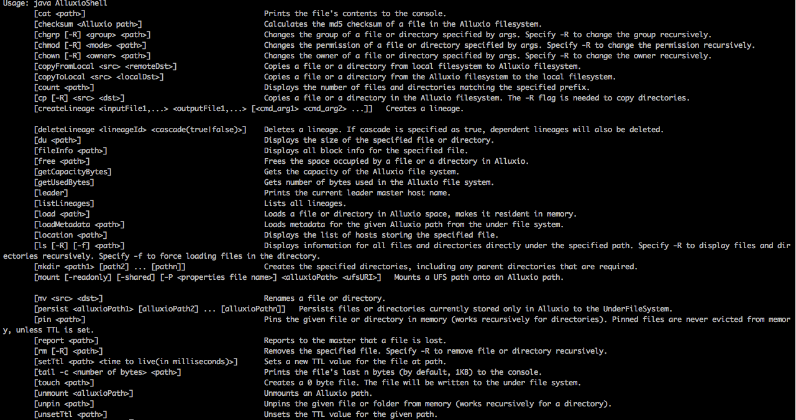
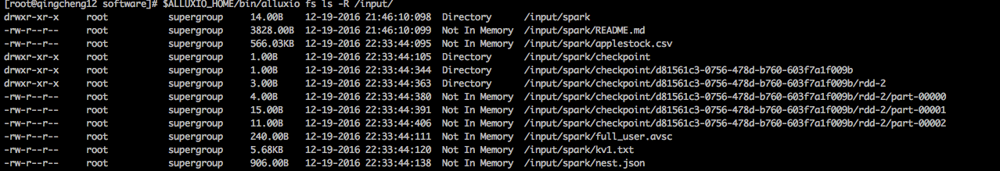

##1.alluxio命令行说明
```
1.全路径使用方式
$ALLUXIO_HOME/bin/alluxio fs ls -R alluxio://qingcheng11:19998/input/

2.短路径使用方式
$ALLUXIO_HOME/bin/alluxio fs ls -R /input/

3.通配符使用方式
3.1以input目录下spar开头的所有文件
$ALLUXIO_HOME/bin/alluxio fs ls -R /input/spar*

3.2input目录下所有目录中的所有csv文件
$ALLUXIO_HOME/bin/alluxio fs ls -R /input/*/*.csv
```

##2.alluxio命令行列表
 

|操作|语法|描述|
|---|---|---|
|load|load "path"|将底层文件系统的文件或者目录加载到Alluxio中|
|rm|rm "path"|删除一个文件，如果输入路径是一个目录该命令失败|
|cat|cat "path"|将Alluxio中的一个文件内容打印在控制台中|
|ls|ls "path"|列出给定路径下的所有直接文件和目录的信息，例如大小|
|cp|cp "src" "dst"|复制文件|
|mv|mv "source" "destination"|将"source"指定的文件或文件夹移动到"destination"指定的新路径，如果"destination"已经存在该命令失败。|
|mkdir|mkdir "path1" ... "pathn"|在给定路径下创建文件夹，以及需要的父文件夹，多个路径用空格或者tab分隔，如果其中的任何一个路径已经存在，该命令失败|
|checksum |checksum "path"	 | |
|chgrp  | chgrp "group" "path" |修改Alluxio中的文件或文件夹的所属组  |
|chmod |chmod "permission" "path"|修改Alluxio中文件或文件夹的访问权限 |
|chown |chown "owner" "path" |修改Alluxio中文件或文件夹的所有者|
|copyFromLocal|copyFromLocal "source path" "remote path"|将“source path”指定的本地文件系统中的文件拷贝到Alluxio中"remote path"指定的路径 如果"remote path"已经存在该命令会失败 |
|copyToLocal|	copyToLocal "remote path" "local path"|将"remote path"指定的Alluxio中的文件复制到本地文件系统中|
|count|count "path"|输出"path"中所有名称匹配一个给定前缀的文件及文件夹的总数|
|du|du "path"|输出一个指定的文件或文件夹的大小|
|fileInfo|fileInfo "path"|输出指定的文件的数据块信息|
|free|free "path"|将Alluxio中的文件或文件夹移除，如果该文件或文件夹存在于底层存储中，那么仍然可以在那访问|
|getCapacityBytes|getCapacityBytes|获取Alluxio文件系统的容量|
|getUsedBytes|getUsedBytes|获取Alluxio文件系统已使用的字节数|
|leader|leader|打印当前Alluxio leader master节点主机名|
|loadMetadata|loadMetadata "path"|将底层文件系统的文件或者目录的元数据加载到Alluxio中|
|location|location "path"|输出包含某个文件数据的主机|
|mount|mount "path" "uri"|将底层文件系统的"uri"路径挂载到Alluxio命名空间中的"path"路径下，"path"路径事先不能存在并由该命令生成。 没有任何数据或者元数据从底层文件系统加载。当挂载完成后，对该挂载路径下的操作会同时作用于底层文件系统的挂载点。|
|unmount|unmount "path"|卸载挂载在Alluxio中"path"指定路径上的底层文件路径，Alluxio中该挂载点的所有对象都会被删除，但底层文件系统会将其保留。|
|persist|persist "path1" ... "pathn"|将仅存在于Alluxio中的文件或文件夹持久化到底层文件系统中|
|pin|pin "path"|将给定文件锁定到内容中以防止剔除。如果是目录，递归作用于其子文件以及里面新创建的文件|
|unpin|unpin "path"|将一个文件解除锁定从而可以对其剔除，如果是目录则递归作用|
|report|report "path"|向master报告一个文件已经丢失|
|setTtl|setTtl "path" "time"|设置一个文件的TTL时间，单位毫秒|
|unsetTtl|unsetTtl "path"|删除文件的ttl值|
|tail|tail "path"|将指定文件的最后1KB内容输出到控制台|
|touch|touch "path"|在指定路径创建一个空文件|

	
##3.alluxio常用命令实战
###3.1命令ls
```
//列出input目录下的所有文件，包含子目录。
$ALLUXIO_HOME/bin/alluxio fs ls -R /input/
```
 
```
1.第一列为权限列表，有10个占位符组成。
  第1个占位符表示文件类型，文件用-，目录用d
  2-4个占位符表示用户权限,5-7表示组权限，8-10表示其他用户权限
  x表示执行权限，w表示写入权限，r表示读取权限。
2.第二列表示文件所属的用户。

3.第三列表示文件所属的组。

4.第四列表示文件大小

5.第五列表示文件创建时间

6.第六列表示文件是否在内存中
  如果是目录显示Directory，如果是文件显示Not In Memory或In Memory
  
7.第七列表示文件的路径信息。
```


		
		
		

