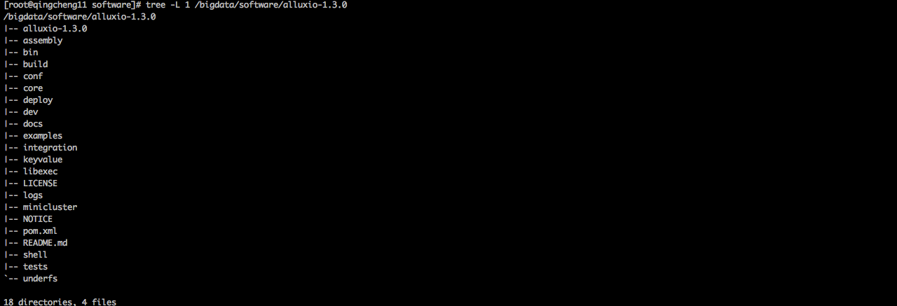
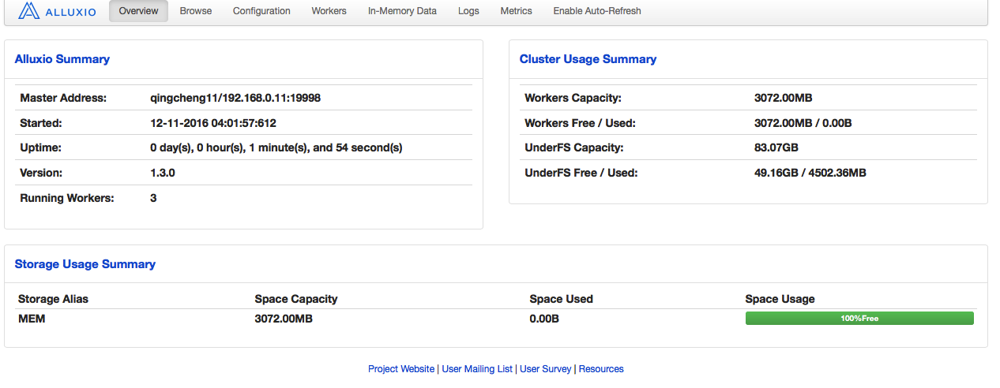
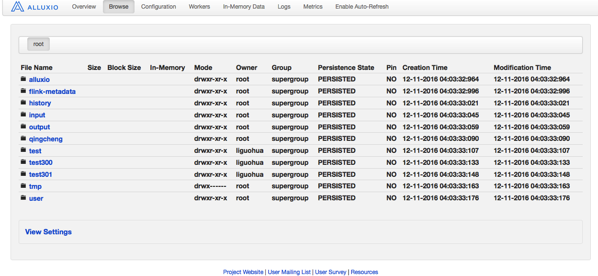
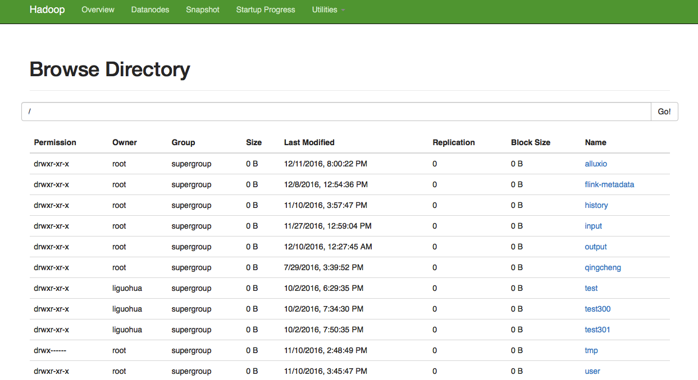
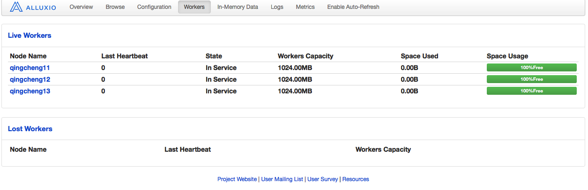
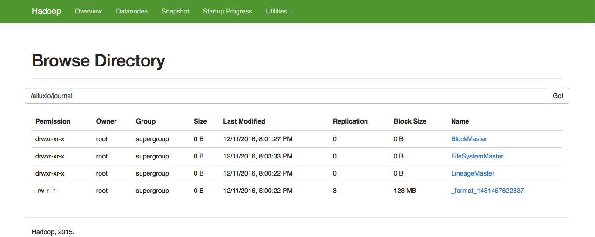

##一、Alluxio软件包的下载与解压 

###1.下载并分发alluxio
```
1.官方网站
http://www.alluxio.org
```
```
2.下载页面
http://www.alluxio.org/download
```
```
3.下载地址
http://downloads.alluxio.org/downloads/files/1.3.0/alluxio-1.3.0-hadoop2.7-bin.tar.gz
```
```
4.解压命令
tar -zxvf alluxio-1.3.0-hadoop2.7-bin.tar.gz
```
```
5.分发命令
scp -r /bigdata/software/alluxio-1.3.0  qingcheng12:/bigdata/software/
scp -r /bigdata/software/alluxio-1.3.0  qingcheng13:/bigdata/software/
```
```
6.查看命令
tree -L 1 /bigdata/software/alluxio-1.3.0 
```
      
###2.配置并分发环境变量
```
1.编辑环境变量文件
1.1执行命令：
    vim ~/.bashrc
1.2添加内容：
    export ALLUXIO_HOME=/bigdata/software/alluxio-1.3.0
    export PATH=$ALLUXIO_HOME/bin:$PATH
2.分发环境变量文件到其他机器
    scp ~/.bashrc  qingcheng12:~/.bashrc
    scp ~/.bashrc  qingcheng13:~/.bashrc
3.在每个机器上刷新环境变量
    source   ~/.bashrc
4.测试环境环境变量是否配置成功 
4.1执行命令：
    $ALLUXIO_HOME
4.2执行效果：
    出现如下字样说明配置成功
    -bash: /bigdata/software/alluxio-1.3.0: Is a directory
```
##二、Alluxio在HA模式下完全分布部署实战
 
###1.配置alluxio-env.sh文件  
```
1.配置命令
cp ${ALLUXIO_HOME}/conf/alluxio-env.sh.template ${ALLUXIO_HOME}/conf/alluxio-env.sh
vim ${ALLUXIO_HOME}/conf/alluxio-env.sh

2.配置内容
export JAVA_HOME=/bigdata/software/jdk1.8.0
export ALLUXIO_UNDERFS_ADDRESS=hdfs://qingcheng11:9000
export ALLUXIO_UNDERFS_HDFS_IMPL=org.apache.hadoop.hdfs.DistributedFileSystem
export ALLUXIO_JAVA_OPTS+="
-Dalluxio.zookeeper.enabled=true
-Dalluxio.zookeeper.address=qingcheng11:2181,qingcheng12:2181,qingcheng13:2181
-Dalluxio.master.journal.folder=${ALLUXIO_UNDERFS_ADDRESS}/alluxio/journal
-Dalluxio.master.bind.host=0.0.0.0
"
```

###2.配置workers文件  
此文件用于指定从节点，一行一个节点.   
```
1.编辑命令
vim ${ALLUXIO_HOME}/conf/workers

2.配置内容
qingcheng11
qingcheng12
qingcheng13
```

###3.分发配置文件
```
scp -r ${ALLUXIO_HOME}/conf/*   qingcheng12:${ALLUXIO_HOME}/conf/
scp -r ${ALLUXIO_HOME}/conf/*   qingcheng13:${ALLUXIO_HOME}/conf/
```

###4.启动Alluxio集群
####4.1格式化Alluxio集群
```
${ALLUXIO_HOME}/bin/alluxio format
```
  
####4.2启动Alluxio集群
```
${ALLUXIO_HOME}/bin/alluxio-start.sh all Mount
```
  

###5.验证Alluxio集群启动情况
####5.1命令验证
```
1.查看命令
jps

2.显示进程
AlluxioWorker
AlluxioMaster
```

####5.2Web验证
```
http://qingcheng11:19999
```
####Alluxio集群概要信息  
   

####Alluxio透视HDFS信息

  

####Alluxio的workers信息
  
####Alluxio在HDFS上注册的信息
  
