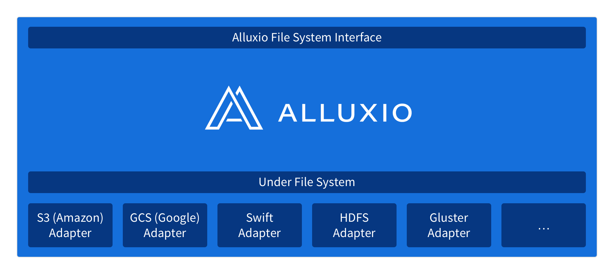

#一、Alluxio简介

##1.没有Alluxio大数据生态圈的现状
 
```
1.大数据生态圈中存在大量的计算引擎和应用程序，比如spark，MapReduce,Flink等。
2.大数据生态圈中也存在大量的存储引擎，比如HDFS,S3,Swift,GFS等。
3.计算引擎要访问存储引擎中的数据，就形成大量的连接信息。规范接口都不统一。
```
##2.Alluxio在大数据生态圈的地位
 
```
1.Alluxio是计算引擎和存储引擎之间的桥梁，屏蔽了不同存储引擎访问的复杂性，统一了接口，统一了规范。
2.Alluxio是能够在内存层面上为不同的计算引擎提供共享数据的可能，能够提高应用程序的运算效率。
3.Alluxio是分布式内存文件系统，要比基于磁盘的文件系统速度快，因而能够加速计算引擎访问数据的速度。
```

##2.Alluxio为大数据生态圈提供统一的命名空间
 
```
1.Alluxio能够统一多种底层文件系统，屏蔽他们之间的接口和规范的复杂性，对外提供简单的
```
