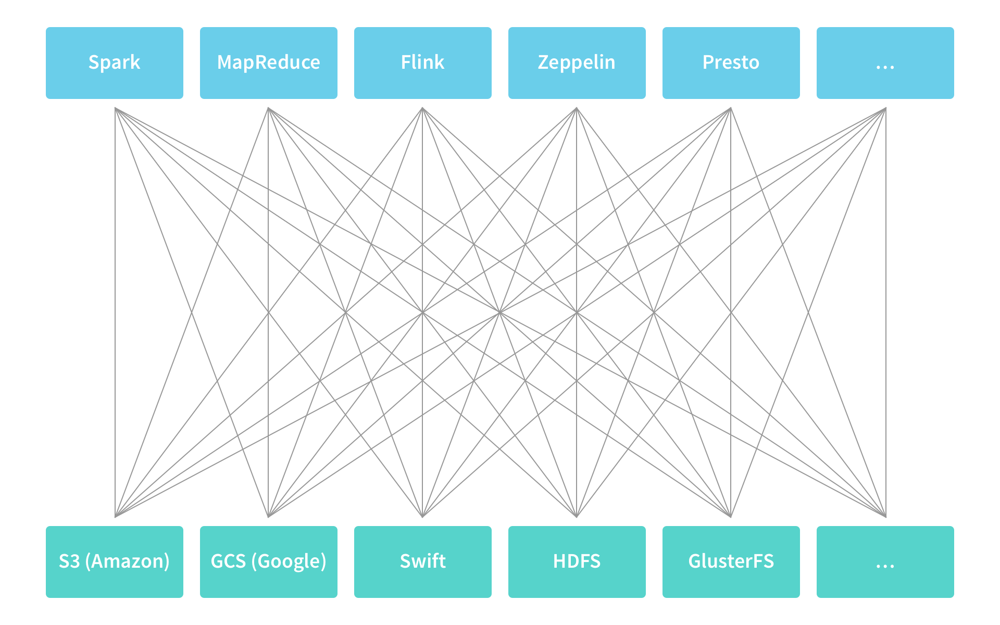
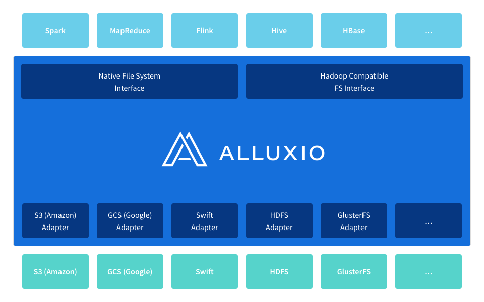
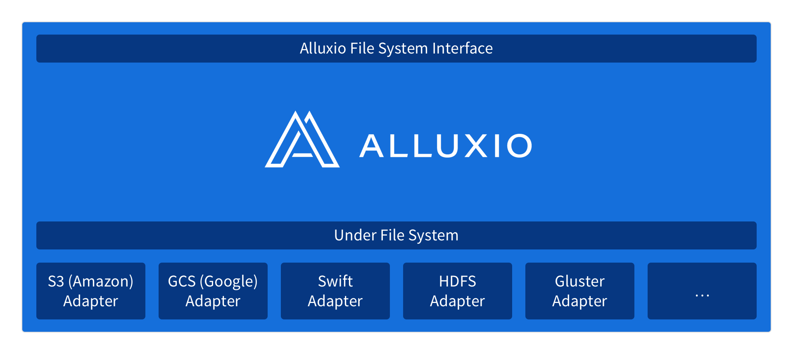
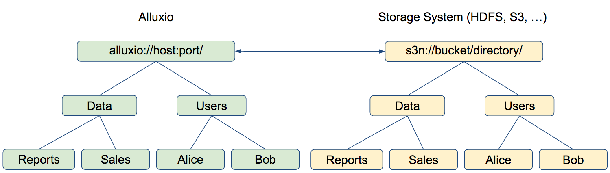
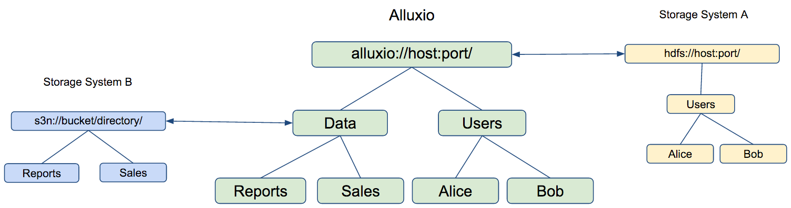

#一、Alluxio简介

##1.没有Alluxio大数据生态圈的现状
 
```
1.大数据生态圈中存在大量的计算引擎和应用程序，比如spark，MapReduce,Flink等。
2.大数据生态圈中也存在大量的存储引擎，比如HDFS,S3,Swift,GFS等。
3.计算引擎要访问存储引擎中的数据，就形成大量的连接信息。规范接口都不统一。
```
##2.Alluxio在大数据生态圈的地位
 
```
1.Alluxio是计算引擎和存储引擎之间的桥梁，屏蔽了不同存储引擎访问的复杂性，统一了接口，统一了规范。
2.Alluxio是能够在内存层面上为不同的计算引擎提供共享数据的可能，能够提高应用程序的运算效率。
3.Alluxio是分布式内存文件系统，要比基于磁盘的文件系统速度快，因而能够加速计算引擎访问数据的速度。
```

##3.Alluxio为大数据生态圈提供统一的命名空间
 
```
1.Alluxio能够统一多种底层文件系统，屏蔽他们之间的接口和规范的复杂性，对外提供简单的访问方式。
2.Alluxio能够提供统一文件存储命名空间。
```
##4.Alluxio和底层文件系统保持一致的命名空间
 
```
1.Alluxio和底层存储系统的命名空间是一致的
  对于需要持久化的对象， Alluxio会保存底层文件系统存储这些对象的文件夹的路径.
  例如，一个用户在根目录下创建了一个Users目录，其中 包含Alice和Bob两个子目录，底层文件系统（如HDFS或S3）
  也会保存相同的目录结构和命名.当用户在 Alluxio文件系统中对一个持久化的对象进行重命名或者删除操作时，底层
  文件系统中对应的对象也会被执行相同的操作。
2.Alluxio能够搜索到底层文件系统中并非通过Alluxio创建的对象
  例如，底层文件系统中包含一个Data文件夹， 其中包含Reports和Sales两个文件，它们都不是通过Alluxio创建的，
  当它们第一次被访问时（例如用户请求打开文 件），Alluxio会自动加载这些对象的元数据。然而在该过程中Alluxio
  不会加载具体文件数据，若要将其加载到Alluxio， 可以用FileInStream读数据，或者通过Alluxio Shell中的
  load命令进行加载。
```
##5.Alluxio支持同时挂载多个文件系统
 
```
1.通过alluxio.underfs.address指定Alluxio 的”primary storage”
  图中主存储（”primary storage”）是HDFS，其中可以包含用户的文件夹；
2.通过挂载API能够在Alluxio中挂载或删除多种数据源，API如下：
  bool mount(String alluxioPath, String ufsPath);
  bool unmount(String alluxioPath);
  图中挂载S3文件系统到Data文件夹下，命令如下：
  mount(alluxio://host:port/Data, s3://bucket/directory)
```

