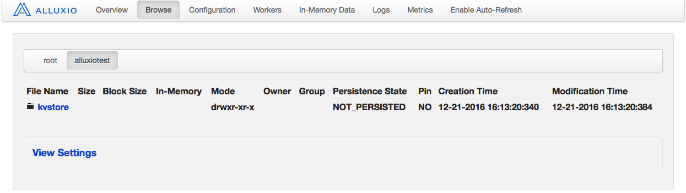

#一、配置支持键值对存储
```
alluxio支持键值对存储的机制。默认没有开启，需要自己去开启
```

##1.测试是否开启键值对存储
```
1.测试命令
./bin/alluxio runKVTest

2.回显如下
Alluxio key value service is disabled. To run this test, please set alluxio.keyvalue.enabled
to be true and restart the cluster.
```
##2.配置开启kev-value存储
```
1.创建alluxio-site.properties
cp $ALLUXIO_HOME/conf/alluxio-site.properties.template $ALLUXIO_HOME/conf/alluxio-site.properties

2. 编辑配置文件
vim  $ALLUXIO_HOME/conf/alluxio-site.properties

3.添加内容如下
alluxio.keyvalue.enabled = true
alluxio.keyvalue.partition.size.bytes.max = 512MB
```
| 属性名 |默认值 |意义|
|---|---|---|
|alluxio.keyvalue.enabled |false |是否开启key-value键值存储服务|
|alluxio.keyvalue.partition.size.bytes.max |512MB|每个分区的大小上限|

##3.重启alluxio
```
1.关闭alluxio
./bin/alluxio-stop.sh all

2.开启alluxio
./bin/alluxio-start.sh local
```
##4.再次测试是否开启键值对存储
```
1.测试命令
./bin/alluxio runKVTest

2.回显如下
Passed the test!
```		
		
#二、键值对存储编程实战	
##1.KVStore写数据实战
```java
package fileSystem.kv;

import alluxio.AlluxioURI;
import alluxio.client.keyvalue.KeyValueStoreWriter;
import alluxio.client.keyvalue.KeyValueSystem;
import alluxio.exception.AlluxioException;
import java.nio.ByteBuffer;
public class KeyValueWriter001 {
    public static void main(String[] args) throws Exception, AlluxioException {
        //1.创建键值对系统实例
        KeyValueSystem kvs = KeyValueSystem.Factory.create();

        //2.开启键值对writer
        KeyValueStoreWriter writer = kvs.createStore(new AlluxioURI("/alluxiotest/kvstore"));

        //3.写入键值对,byte[]类型数据
        writer.put("100".getBytes(), "foo".getBytes());

        //4.写入键值对,ByteBuffer类型数据
        writer.put(ByteBuffer.wrap("200".getBytes()), ByteBuffer.wrap("bar".getBytes()));

        //5.关闭键值对writer
        writer.close();
    }
}
```
 

##2.KVStore读数据实战
```java
package fileSystem.kv;

import alluxio.AlluxioURI;
import alluxio.client.keyvalue.KeyValueStoreReader;
import alluxio.client.keyvalue.KeyValueSystem;
import alluxio.exception.AlluxioException;

import java.nio.ByteBuffer;
import java.nio.CharBuffer;
import java.nio.charset.Charset;
import java.nio.charset.CharsetDecoder;

public class KeyValueReader001 {
    public static void main(String[] args) throws Exception, AlluxioException {
        //1.创建键值对系统实例
        KeyValueSystem kvs = KeyValueSystem.Factory.create();

        //2.开启键值对reader
        KeyValueStoreReader reader = kvs.openStore(new AlluxioURI("/alluxiotest/kvstore"));

        //3.根据键读取值,byte[]类型数据
        byte[] test1 = reader.get("100".getBytes());
        String test1Str = new String(test1);
        System.out.println(test1Str);

        //4.根据键读取值,ByteBuffer类型数据
        ByteBuffer test2 = reader.get(ByteBuffer.wrap("200".getBytes()));
        Charset charset = Charset.forName("UTF-8");
        CharsetDecoder decoder = charset.newDecoder();
        CharBuffer charBuffer = decoder.decode(test2.asReadOnlyBuffer());
        String test2Str = charBuffer.toString();
        System.out.println(test2Str);

        //5.获取键值对存储的实际大小
        System.out.println("键值对存储的大小=" + reader.size());

        //6.关闭键值对reader
        reader.close();
    }
}
```
##3.KVStore遍历数据实战
```java
package fileSystem.kv;

import alluxio.AlluxioURI;
import alluxio.client.keyvalue.KeyValueIterator;
import alluxio.client.keyvalue.KeyValuePair;
import alluxio.client.keyvalue.KeyValueStoreReader;
import alluxio.client.keyvalue.KeyValueSystem;
import alluxio.exception.AlluxioException;

import java.nio.charset.Charset;
import java.nio.charset.CharsetDecoder;

public class KeyValueReader002 {
    public static void main(String[] args) throws Exception, AlluxioException {
        //1.创建键值对系统实例
        KeyValueSystem kvs = KeyValueSystem.Factory.create();

        //2.开启键值对reader
        KeyValueStoreReader reader = kvs.openStore(new AlluxioURI("/alluxiotest/kvstore"));

        //3.通过迭代器遍历存储中的键值对
        //3.1创建解码器
        Charset charset = Charset.forName("UTF-8");
        CharsetDecoder decoder = charset.newDecoder();

        //3.2遍历并解码
        KeyValueIterator iterator = reader.iterator();
        while (iterator.hasNext()) {
            KeyValuePair pair = iterator.next();
            String key = decoder.decode(pair.getKey().asReadOnlyBuffer()).toString();
            String value = decoder.decode(pair.getValue().asReadOnlyBuffer()).toString();
            System.out.println("key=" + key + ",value=" + value);
        }
        //4.关闭键值对reader
        reader.close();
    }
}
```
#三、封装KVStoreAPI工具类
```java
package fileSystem.kv;

import alluxio.AlluxioURI;
import alluxio.client.keyvalue.*;
import alluxio.exception.AlluxioException;

import java.io.IOException;
import java.nio.charset.Charset;
import java.nio.charset.CharsetDecoder;
import java.util.*;

public class AlluxioKvUtils {
    //创建键值对系统实例
    private static final KeyValueSystem kvs = KeyValueSystem.Factory.create();
    private static final String CHAR_SET_UTF8 = "UTF-8";

    /**
     * 此方法用于删除KVStore
     *
     * @param storePath KVStore路径
     */
    public static void deleteStore(String storePath) {
        try {
            kvs.deleteStore(new AlluxioURI(storePath));
        } catch (IOException e) {
            e.printStackTrace();
        } catch (AlluxioException e) {
            e.printStackTrace();
        }
    }

    /**
     * 此方法用于重命名 KVStore
     *
     * @param oldPath oldPath
     * @param newPath newPath
     */
    public static void renameStore(String oldPath, String newPath) {
        try {
            kvs.renameStore(new AlluxioURI(oldPath), new AlluxioURI(newPath));
        } catch (IOException e) {
            e.printStackTrace();
        } catch (AlluxioException e) {
            e.printStackTrace();
        }
    }

    /**
     * 此方法用于合并两个 KVStore,会删除fromKVStore
     *
     * @param fromPath fromPath
     * @param toPath   toPath
     */
    public static void mergeStore(String fromPath, String toPath) {
        try {
            kvs.mergeStore(new AlluxioURI(fromPath), new AlluxioURI(toPath));
        } catch (IOException e) {
            e.printStackTrace();
        } catch (AlluxioException e) {
            e.printStackTrace();
        }
    }


    /**
     * 此方法用于写入map数据到KVStore
     *
     * @param storePath KVStore路径
     */
    public static void write(String storePath, String key, String value) {
        write(storePath, key, value, CHAR_SET_UTF8);
    }

    /**
     * 此方法用于写入map数据到KVStore
     *
     * @param storePath KVStore路径
     */
    public static void write(String storePath, String key, String value, String charSet) {
        Map<String, String> map = new HashMap<>();
        map.put(key, value);
        write(storePath, map, charSet);
    }

    /**
     * 此方法用于写入map数据到KVStore
     *
     * @param storePath KVStore路径
     * @param map       数据map
     */
    public static void write(String storePath, Map<String, String> map) {
        write(storePath, map, CHAR_SET_UTF8);
    }

    /**
     * 此方法用于写入map数据到KVStore
     *
     * @param storePath KVStore路径
     * @param map       数据map
     * @param charSet   charSet
     */
    public static void write(String storePath, Map<String, String> map, String charSet) {
        //2.开启键值对writer
        KeyValueStoreWriter writer = null;

        //3.写入键值对,byte[]类型数据
        try {
            writer = kvs.createStore(new AlluxioURI(storePath));
            Set<String> keys = map.keySet();
            for (String key : keys) {
                writer.put(key.getBytes(charSet), map.get(key).getBytes(charSet));
            }
        } catch (IOException e) {
            e.printStackTrace();
        } catch (AlluxioException e) {
            e.printStackTrace();
        } finally {
            //5.关闭键值对writer
            try {
                if (writer != null) {
                    writer.close();
                }
            } catch (IOException e) {
                e.printStackTrace();
            }
        }
    }

    /**
     * 此方法用于读取KVStore集合到String
     *
     * @param storePath KVStore路径
     * @param key       key
     * @return value
     */
    public static String get(String storePath, String key) {
        return get(storePath, key, CHAR_SET_UTF8);
    }

    /**
     * 此方法用于读取KVStore集合到String
     *
     * @param storePath KVStore路径
     * @param key       key
     * @param charSet   charSet
     * @return value
     */
    public static String get(String storePath, String key, String charSet) {
        List<String> list = new ArrayList<>();
        list.add(key);
        return (String) get2Collection(storePath, list, charSet).toArray()[0];
    }

    /**
     * 此方法用于读取KVStore集合到list
     *
     * @param storePath KVStore路径
     * @param keys      keys
     * @return collection
     */
    public static Collection<String> get2Collection(String storePath, List<String> keys) {
        return get2Collection(storePath, keys, CHAR_SET_UTF8);
    }

    /**
     * 此方法用于读取KVStore集合到list
     *
     * @param storePath KVStore路径
     * @param keys      keys
     * @param charSet   charSet
     * @return collection
     */
    public static Collection<String> get2Collection(String storePath,
    List<String> keys, String charSet) {
        Map<String, String> map = get2Map(storePath, keys, charSet);
        return map.values();
    }

    /**
     * 此方法用于读取KVStore集合到map
     *
     * @param storePath KVStore路径
     * @param key       key
     * @return map
     */
    public static Map<String, String> get2Map(String storePath, String key) {
        List<String> list = new ArrayList<>();
        list.add(key);
        return get2Map(storePath, list, CHAR_SET_UTF8);
    }

    /**
     * 此方法用于读取KVStore集合到map
     *
     * @param storePath KVStore路径
     * @param key       key
     * @param charSet   charSet
     * @return map
     */
    public static Map<String, String> get2Map(String storePath, String key, String charSet) {
        List<String> list = new ArrayList<>();
        list.add(key);
        return get2Map(storePath, list, charSet);
    }

    /**
     * 此方法用于读取KVStore集合到map
     *
     * @param storePath KVStore路径
     * @param keys      keys
     * @return map
     */
    public static Map<String, String> get2Map(String storePath, List<String> keys) {
        return get2Map(storePath, keys, CHAR_SET_UTF8);
    }

    /**
     * 此方法用于读取KVStore集合到map
     *
     * @param storePath KVStore路径
     * @param keys      keys
     * @param charSet   charSet
     * @return map
     */
    public static Map<String, String> get2Map(String storePath, List<String> keys, String charSet) {
        Map<String, String> map = new HashMap<>();
        //1.开启键值对reader
        KeyValueStoreReader reader = null;
        try {
            reader = kvs.openStore(new AlluxioURI(storePath));
            for (String key : keys) {
                //2.根据键读取值,byte[]类型数据
                String v = new String(reader.get(key.getBytes()), charSet);
                map.put(key, v);
            }
        } catch (IOException e) {
            e.printStackTrace();
        } catch (AlluxioException e) {
            e.printStackTrace();
        } finally {
            try {
                //3.关闭键值对reader
                if (reader != null) {
                    reader.close();
                }
            } catch (IOException e) {
                e.printStackTrace();
            }
        }
        return map;
    }

    /**
     * 此方法用于读取KVStore集合到Collection
     *
     * @param storePath KVStore路径
     * @param charSet   charSet
     * @return Collection
     */
    public static Collection<String> getAll2Collection(String storePath, String charSet) {
        Map<String, String> map = getAll2Map(storePath, charSet);
        return map.values();
    }

    /**
     * 此方法用于读取KVStore集合到map
     *
     * @param storePath KVStore路径
     * @return map
     */
    public static Map<String, String> getAll2Map(String storePath) {
        return getAll2Map(storePath, CHAR_SET_UTF8);
    }

    /**
     * 此方法用于读取KVStore集合到map
     *
     * @param storePath KVStore路径
     * @param charSet   charSet
     * @return map
     */
    public static Map<String, String> getAll2Map(String storePath, String charSet) {
        Map<String, String> map = new HashMap<>();
        //2.开启键值对reader
        KeyValueStoreReader reader = null;
        try {
            reader = kvs.openStore(new AlluxioURI(storePath));

            //3.通过迭代器遍历存储中的键值对
            //3.1创建解码器
            Charset charset = Charset.forName(charSet);
            CharsetDecoder decoder = charset.newDecoder();

            //3.2遍历并解码
            KeyValueIterator iterator = reader.iterator();
            while (iterator.hasNext()) {
                KeyValuePair pair = iterator.next();
                String key = decoder.decode(pair.getKey().asReadOnlyBuffer()).toString();
                String value = decoder.decode(pair.getValue().asReadOnlyBuffer()).toString();
                map.put(key, value);
            }

        } catch (IOException e) {
            e.printStackTrace();
        } catch (AlluxioException e) {
            e.printStackTrace();
        } finally {
            //4.关闭键值对reader
            try {
                if (reader != null) {
                    reader.close();
                }
            } catch (IOException e) {
                e.printStackTrace();
            }
        }
        return map;
    }
}
```


